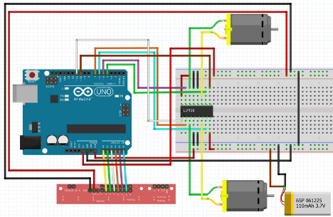

# Line-Follower - Introduction to Robotics project

## Requirement:
Design and develop a Line Follower Robot. This must include calibration with automatic motor movement and fimishing a line follower in a fast manner with visible control (PID controller).

## Components:

1. Arduino Uno
2. Zip-ties
3. LiPo battery
4. Wheels (2)
5. Wires for the line sensor (female - male)
6. QTR-8A reflectance sensor, along with screws
7. Ball caster
8. Extra wires from the kit or lab
9. Chassis
10. Breadboard - medium (400pts)
11. L293D motor driver
12. DC motors (2)

## Step 1 - Designing the chassis, testing the components and implementing the circuit:

In order to achieve a fast time completing the circuit, the chassis was to designed to distribute the weight of the components and for stability on the corners we went for a large wheel base. Also, for avoiding malfunction, every component was tested individually.

The built-in examples for testing components can be found here:
- https://codebender.cc/example/QTRSensors/QTRAExample#QTRAExample.ino - QTR sensor
- https://docs.arduino.cc/learn/electronics/stepper-motors/ - DC motors
After testing each component we can start implementing the circuit. Below is the circuit diagram:


Here is the finalised circuit applied on the chassis: 


## Step 2 - Implementing the code:

The following Arduino code is a motor control system that utilizes a PID (Proportional-Integral-Derivative) controller to adjust the speed of two motors based on input from an array of six analog sensors. The system is designed to follow a line by adjusting the motor speeds to keep the robot on the desired path.

### Variable Setup:

First part is the declaration of constants and variables. Motor pins, PID constants (kp, ki, kd), and speed limits (maxSpeed, minSpeed) are defined. Two motor speeds (m1Speed, m2Speed), PID components (p, i, d), and error tracking variables are initialized.

```
#include <QTRSensors.h>

const int m11Pin = 7;
const int m12Pin = 6;
const int m21Pin = 5;
const int m22Pin = 4;
const int m1Enable = 11;
const int m2Enable = 10;

int m1Speed = 0;
int m2Speed = 0;

float kp = 4.8;
float ki = 0.1;
float kd = 45;

int p = 1;
int i = 0;
int d = 0;

int error = 0;
int lastError = 0;

const int maxSpeed = 255;
const int minSpeed = -255;
const int baseSpeed = 255;

QTRSensors qtr;

const int sensorCount = 6;
int sensorValues[sensorCount];
int sensors[sensorCount] = {0, 0, 0, 0, 0, 0};
``` 

### Sensor configuration:

The QTRSensors library is used to handle analog sensor readings. Sensor pins are defined, and an array for sensor values is declared.

### Setup function:

The setup() function initializes the motor pins, configures the sensors, calibrates them by executing controlled movements during the first seconds after startup, and initializes the Serial communication for debugging purposes.

### Motor control methods:

1. setupMotors(): Configures the pins for the motors and their respective enables.
2. calibrateSensors(): Iteratively calibrates the sensors by moving the robot in different directions.
3. setMotorSpeed(int motor1Speed, int motor2Speed): Controls the direction and speed of the two motors based on input speed values.
4. calculatePID(): Reads the sensor values and computes the error.
5. adjustMotorSpeed(): Implements the PID control algorithm to adjust the motor speeds based on the calculated error.

### PID control:

The PID control is implemented by adjusting the motor speeds (m1Speed and m2Speed) based on the proportional, integral, and derivative components of the error. This allows the robot to make fine adjustments to maintain its position on the line. The PID values (kp, ki, kd) determine the responsiveness and stability of the control system.

Side view of the robot: 


## Step 3 - Final code:
```
#include <QTRSensors.h>

// Motor pin assignments
const int m11Pin = 7;
const int m12Pin = 6;
const int m21Pin = 5;
const int m22Pin = 4;
const int m1Enable = 11;
const int m2Enable = 10;

// Motor speed variables
int m1Speed = 0;
int m2Speed = 0;

// PID constants
float kp = 4.8;
float ki = 0.1;
float kd = 45;

// PID components
int p = 1;
int i = 0;
int d = 0;

// Error tracking variables
int error = 0;
int lastError = 0;

// Speed limits
const int maxSpeed = 255;
const int minSpeed = -255;
const int baseSpeed = 255;

// QTRSensors instance
QTRSensors qtr;

// Sensor configuration
const int sensorCount = 6;
int sensorValues[sensorCount];
int sensors[sensorCount] = {0, 0, 0, 0, 0, 0};

// Function prototypes
void setupMotors();
void calibrateSensors();
void setMotorSpeed(int, int);
void calculatePID();
void adjustMotorSpeed();

void setup() {
  setupMotors(); // Initialize motor pins
  qtr.setTypeAnalog(); // Configure sensor type
  qtr.setSensorPins((const uint8_t[]){A0, A1, A2, A3, A4, A5}, sensorCount); // Set sensor pins
  delay(500);
  pinMode(LED_BUILTIN, OUTPUT);
  digitalWrite(LED_BUILTIN, HIGH);
  calibrateSensors(); // Calibrate sensors
  digitalWrite(LED_BUILTIN, LOW);
  Serial.begin(9600);
}

void loop() {
  calculatePID(); // Update PID components based on sensor readings
  adjustMotorSpeed(); // Adjust motor speeds using PID values

  // DEBUGGING
  // Serial.print("Error: ");
  // Serial.println(error);
  // Serial.print("M1 speed: ");
  // Serial.println(m1Speed);
  //
  // Serial.print("M2 speed: ");
  // Serial.println(m2Speed);
  //
  // delay(250);
}

void setupMotors() {
  // Configure motor pins
  pinMode(m11Pin, OUTPUT);
  pinMode(m12Pin, OUTPUT);
  pinMode(m21Pin, OUTPUT);
  pinMode(m22Pin, OUTPUT);
  pinMode(m1Enable, OUTPUT);
  pinMode(m2Enable, OUTPUT);
}

void calibrateSensors() {
  // Calibrate sensors by moving the robot in different directions
  for (uint16_t i = 0; i < 100; i++) {
    qtr.calibrate();
    if (i < 25 && i > 0) {
      setMotorSpeed(160, 0);
    } else if (i < 50 && i > 25) {
      setMotorSpeed(-200, 0);
    } else if (i < 75 && i > 50) {
      setMotorSpeed(0, 160);
    } else if (i < 100 && i > 75) {
      setMotorSpeed(0, -200);
    }
  }
}

void setMotorSpeed(int motor1Speed, int motor2Speed) {
  // Set motor speeds and directions based on input values
  if (motor1Speed == 0) {
    digitalWrite(m11Pin, LOW);
    digitalWrite(m12Pin, LOW);
    analogWrite(m1Enable, motor1Speed);
  } else {
    if (motor1Speed > 0) {
      digitalWrite(m11Pin, HIGH);
      digitalWrite(m12Pin, LOW);
      analogWrite(m1Enable, motor1Speed);
    }
    if (motor1Speed < 0) {
      digitalWrite(m11Pin, LOW);
      digitalWrite(m12Pin, HIGH);
      analogWrite(m1Enable, -motor1Speed);
    }
  }
  if (motor2Speed == 0) {
    digitalWrite(m21Pin, LOW);
    digitalWrite(m22Pin, LOW);
    analogWrite(m2Enable, motor2Speed);
  } else {
    if (motor2Speed > 0) {
      digitalWrite(m21Pin, HIGH);
      digitalWrite(m22Pin, LOW);
      analogWrite(m2Enable, motor2Speed);
    }
    if (motor2Speed < 0) {
      digitalWrite(m21Pin, LOW);
      digitalWrite(m22Pin, HIGH);
      analogWrite(m2Enable, -motor2Speed);
    }
  }
}

void calculatePID() {
  // Read sensor values and compute PID components
  error = map(qtr.readLineBlack(sensorValues), 0, 5000, -50, 50);
  p = error;
  i = i + error;
  d = error - lastError;
}

void adjustMotorSpeed() {
  // Adjust motor speeds based on PID values and error
  int motorSpeed = kp * p + ki * i + kd * d;
  m1Speed = baseSpeed;
  m2Speed = baseSpeed;

  if (error < 0) {
    m1Speed += motorSpeed;
  } else if (error > 0) {
    m2Speed -= motorSpeed;
  }

  if (error < -40 || error > 40) {
    m1Speed = constrain(m1Speed, minSpeed, maxSpeed);
    m2Speed = constrain(m2Speed, minSpeed, maxSpeed);
  } else {
    m1Speed = constrain(m1Speed, 0, maxSpeed);
    m2Speed = constrain(m2Speed, 0, maxSpeed);
  }

  setMotorSpeed(m1Speed, m2Speed);
}

```

Here you can check the video of the robot finishing the line follower:
https://youtube.com/shorts/lVEEIvE1BMo
